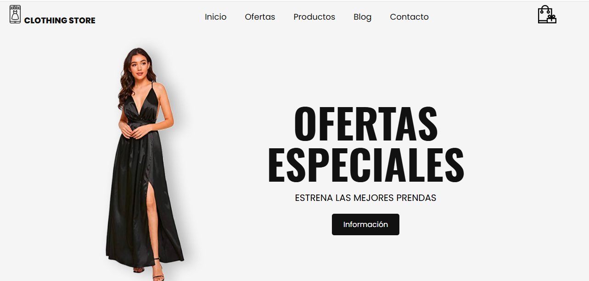

# 🛍️ Clothing Store - Tienda de Ropa Online

**Clothing Store** es una página web moderna y responsive diseñada para una tienda de ropa online. La web ofrece una experiencia de usuario sencilla, clara y atractiva para promocionar ofertas especiales y diferentes categorías de productos.

> *Estrena las mejores prendas al mejor precio.*


## 🌟 Características del Proyecto

- Sección de **Inicio** con banner de ofertas especiales.
- Navegación por secciones: Inicio, Ofertas, Productos, Blog y Contacto.
- Carrito funcional para agregar y quitar productos, vaciar carrito.
- Diseño limpio, minimalista y enfocado en la conversión.
- Incluye imágenes y estilos personalizados.
- Iconos relacionados con moda y compras.
  

## 🛠️ Tecnologías Utilizadas

- **HTML5**
- **CSS3**
- **JavaScript**
  

## 📁 Estructura del Proyecto

```
CLOTHING-STORE/
├── images/
├── index.html
├── script.js
├── style.css
└── README.md
```


## 🖼️ Vista Inicial




## 🌐 Cómo visualizar el proyecto

1. Abre el archivo `index.html` en tu navegador.
2. Verifica que la carpeta `images/` tenga las imágenes necesarias.
3. Asegúrate de que los enlaces a `style.css` y `script.js` estén bien referenciados.
   

## 🚀 Opcional: Despliegue en GitHub Pages

Si quieres publicar tu tienda online de manera gratuita:

1. Sube tu proyecto a un repositorio en GitHub.
2. Ve a la configuración del repositorio.
3. En la sección **Pages**, selecciona la rama `main` y carpeta `/root`.
4. GitHub generará el enlace de tu sitio.

🔗 Puedes ver el sitio en línea aquí:  
https://yasmintorresdesign.github.io/Clothing-Store/


## 📬 Contacto

Para dudas o sugerencias:
📧 yatorres.73@gmail.com

---
